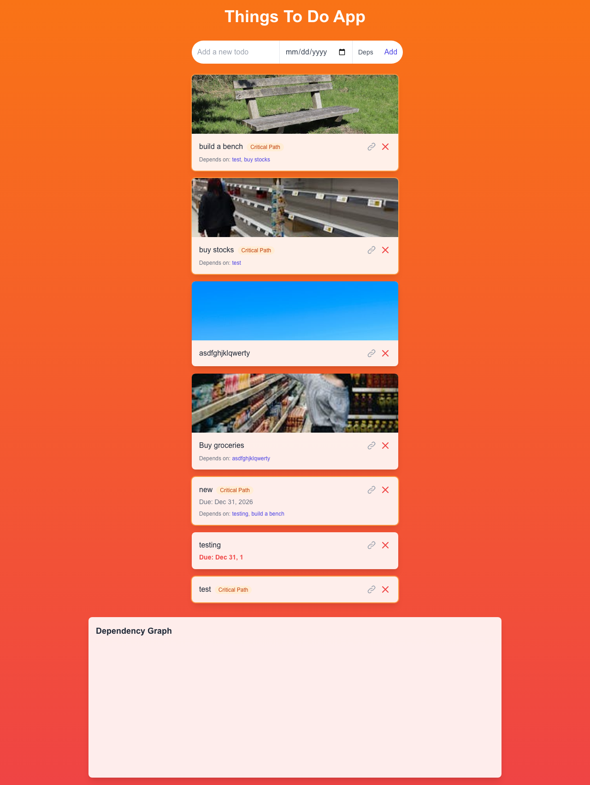

## Soma Capital Technical Assessment

This is a technical assessment as part of the interview process for Soma Capital.

> [!IMPORTANT]  
> You will need a Pexels API key to complete the technical assessment portion of the application. You can sign up for a free API key at https://www.pexels.com/api/  

To begin, clone this repository to your local machine.

## Development

This is a [NextJS](https://nextjs.org) app, with a SQLite based backend, intended to be run with the LTS version of Node.

To run the development server:

```bash
npm i
npm run dev
```

## Task:

Modify the code to add support for due dates, image previews, and task dependencies.

### Part 1: Due Dates 

When a new task is created, users should be able to set a due date.

When showing the task list is shown, it must display the due date, and if the date is past the current time, the due date should be in red.

### Part 2: Image Generation 

When a todo is created, search for and display a relevant image to visualize the task to be done. 

To do this, make a request to the [Pexels API](https://www.pexels.com/api/) using the task description as a search query. Display the returned image to the user within the appropriate todo item. While the image is being loaded, indicate a loading state.

You will need to sign up for a free Pexels API key to make the fetch request. 

### Part 3: Task Dependencies

Implement a task dependency system that allows tasks to depend on other tasks. The system must:

1. Allow tasks to have multiple dependencies
2. Prevent circular dependencies
3. Show the critical path
4. Calculate the earliest possible start date for each task based on its dependencies
5. Visualize the dependency graph

## Solution




### Part 1: Due Dates

Added an optional due date picker to the todo creation form. Due dates are stored in the database and displayed on each todo card. Overdue dates are highlighted in red.

- **Schema**: Added `dueDate DateTime?` to the `Todo` model
- **API**: POST accepts an optional `dueDate`, converts to `Date` or `null`
- **UI**: Date input in the creation form, formatted display on each card, red styling for overdue items

### Part 2: Image Generation

Each new todo automatically fetches a relevant image from the Pexels API based on the task title. Images are fetched once at creation time and the URL is stored in the database.

- **Schema**: Added `imageUrl String?` to the `Todo` model
- **API**: POST handler calls Pexels search API with the todo title, stores the first result's medium image URL
- **Image Proxy**: Pexels blocks browser hotlinking, so images are served through a server-side proxy route (`/api/image-proxy`) that fetches from Pexels and pipes the bytes back to the client

### Part 3: Task Dependencies

Implemented a full dependency system with circular dependency prevention, critical path analysis, and a canvas-based dependency graph.

- **Data Model**: A `Dependency` join table with `dependentId`/`dependencyId` foreign keys, unique constraint, and cascade deletes
- **Dependency API** (`/api/todos/[id]/dependencies`): POST to add a dependency (with DFS cycle detection), DELETE to remove one
- **Critical Path API** (`/api/todos/critical-path`): Topological sort via Kahn's algorithm, forward pass for earliest start/finish, backward pass to identify the critical path (zero-slack nodes)
- **UI**: "Deps" button on the creation form to select dependencies, link icon on each card to add/remove dependencies on existing todos, orange "Critical Path" badge on critical tasks
- **Graph**: Canvas-based visualization with layered topological layout, bezier curve edges, orange highlighting for critical path nodes and edges, HiDPI/Retina support

### Project Structure

```
components/          — Reusable UI components
  TodoApp.tsx        — Page-level composition
  TodoForm.tsx       — Creation form with date + dependency picker
  TodoItem.tsx       — Individual todo card
  DependencyGraph.tsx — Canvas-based graph visualization
hooks/
  useTodos.ts        — Custom hook for all todo state and API calls
app/api/             — API routes with Prisma
  todos/route.ts     — GET/POST todos
  todos/[id]/route.ts — DELETE todo
  todos/[id]/dependencies/route.ts — POST/DELETE dependencies
  todos/critical-path/route.ts — GET critical path analysis
  image-proxy/route.ts — Server-side image proxy for Pexels
lib/
  prisma.ts          — Prisma client singleton
prisma/
  schema.prisma      — Database schema
```

## Submission:

1. Add a new "Solution" section to this README with a description and screenshot or recording of your solution.
2. Push your changes to a public GitHub repository.
3. Submit a link to your repository in the application form.

Thanks for your time and effort. We'll be in touch soon!
